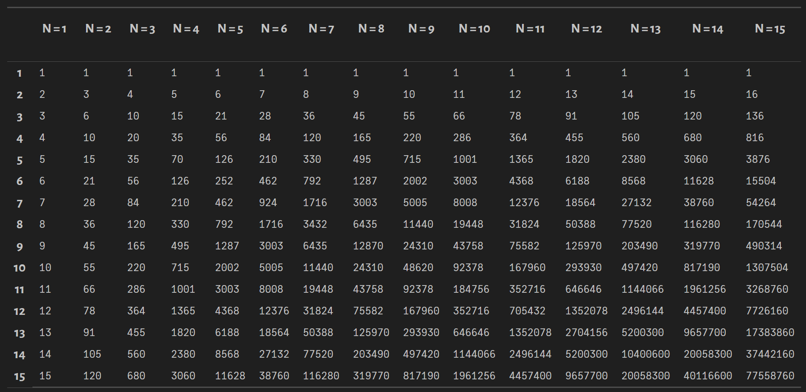
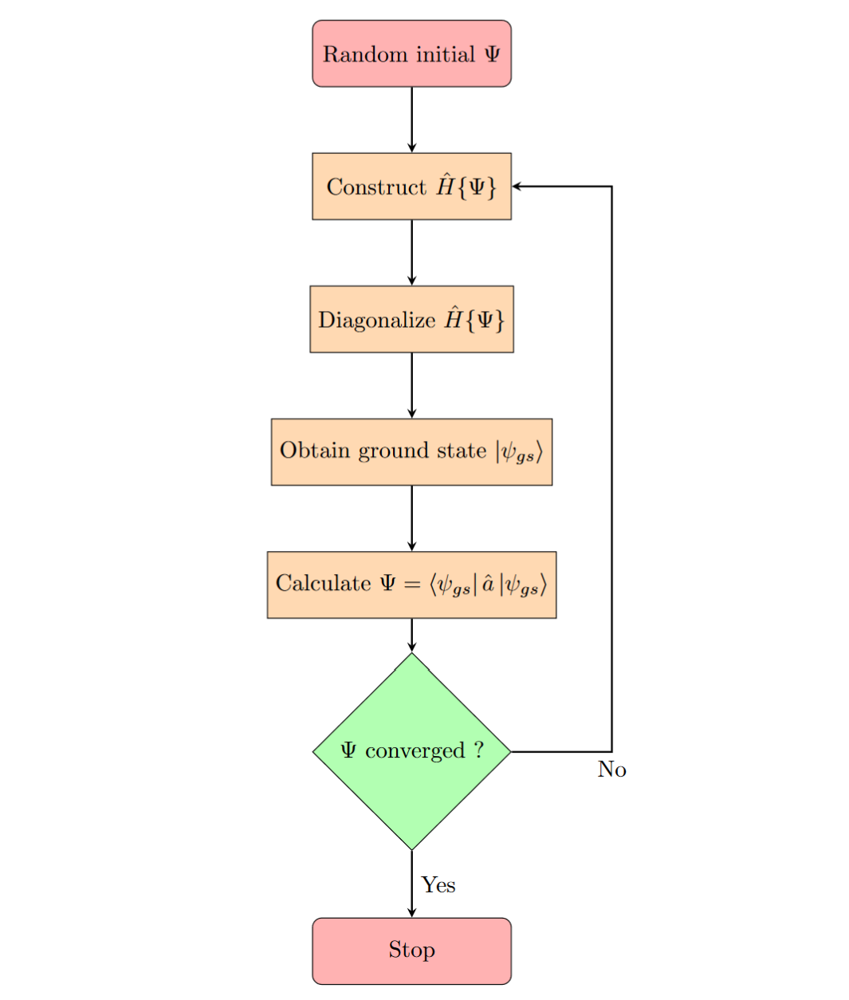
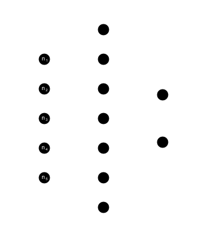

```{r setup, include=FALSE}
knitr::opts_chunk$set(echo = FALSE)
```

## Interacting bosons in a lattice
<br>

$$H = -t\sum_{\langle i, j \rangle} a_i^{\dagger}a_j + \frac{U}{2}\sum_i n_i(n_i - 1)$$
<br>
<center>
{width=40%}
</center>

## Phases of the BHM

### Mott Insulator

$$\small H = \frac{U}{2}\sum_i n_i(n_i - 1) \hspace{0.5cm}\longrightarrow\hspace{0.5cm} |\Psi_{MI}\rangle = \prod_{i=1}^M |n\rangle$$
<center>
{width=50%}
</center>

### Superfluid

$$\small H = -t\sum_{\langle i, j \rangle} a_i^{\dagger}a_j\hspace{0.5cm}\longrightarrow\hspace{0.5cm}|\Psi_{SF}\rangle= \frac{1}{N!} (\sum_{i=1}^M a_i^{\dagger})^N |{0}\rangle \hspace{0.5cm}$$

<center>
{width=50%}
</center>

## Exact Diagonalization

Consider N bosons in M lattice sites.

<br>

- $$\text{Enumerate basis set: }\hspace{0.5cm} |n_1, n_2, ..., n_M\rangle \hspace{0.5cm} s.t. \hspace{0.5cm} \sum_{i=1}^M n_i = N$$
<br>
- $$\text{Construct hamiltonian matrix: }\hspace{0.5cm} \langle n_1, n_2, ..., n_M| \hspace{0.1cm}\hat{H} \hspace{0.1cm}| n_1', n_2', ..., n_M'\rangle$$
<br>
- $$\text{Diagonalize the hamiltonian: } \hspace{0.5cm} H|\psi\rangle = E|\psi\rangle$$


## Results (ED)
<center>
{width=70%}
</center>

## Sparsity of the Hamiltonian
<center>
{width=55%}
</center>

<br>
10 bosons; 10 lattice sites.

## Dimensionality scaling
$$\small\text{Dim }(\mathcal{H}) = \frac{(N+M-1)!}{N!(M-1)!}$$
<center>
{width=80%}
</center>
## Order of Magnitude
<center>
{width=70%}
</center>

## Mean Field Theory
<br>
$$\small \hat{a}_i = \Psi + \delta\hat{a}_i \hspace{1cm} \Bigg |\hspace{1cm}\mathcal{O}(\delta \hat{a}_i ^2) \approx 0$$
<br>
<center>
{width=100%}

</center>
<br>
$$\small \underbrace{H = -t\sum_{\langle i, j \rangle} a_i^{\dagger}a_j + \frac{U}{2}\sum_i n_i(n_i - 1)}_{\text{coupled lattice sites}} \hspace{0.5cm}\longrightarrow\hspace{0.5cm} \underbrace{H \{\Psi \} = \sum_i-zt \cdot (\Psi^*a_i + \Psi a_i^{\dagger} - |\Psi|^2) + \frac{U}{2}n_i(n_i -1)}_{\text{de-coupled lattice sites}}$$

## Solution (MFT)
<br>
To find the equilibrium state of the system, we must minimize $G = H - \mu N + TS$.
<br>
<br>
$$\frac{\partial \langle G\rangle}{\partial \Psi} = \frac{\partial \langle H - \mu N\rangle}{\partial \Psi}\Bigg|_{T=0K} = 0$$
<br>

$$ \Psi = \langle \psi_{gs} |\hat{a} | \psi_{gs} \rangle$$
<br>
$$\text{Minimize G} \equiv \text{Self-consistently diagonalize } H\{\Psi\}$$

## Algorithm (MFT)

<center>
{width=40%}
</center>

## Results (MFT)
<center>
{width=70%}
</center>

## Results (MFT, contd.)
<center>
{width=55%}
</center>

## Cluster Mean Field Theory

<br>
<br>

<center>
{width=90%}
</center>

$$\small \underbrace{H = -t\sum_{\langle i, j \rangle} a_i^{\dagger}a_j + \frac{U}{2}\sum_i n_i(n_i - 1)}_{\text{coupled lattice sites}} \hspace{0.5cm}\longrightarrow\hspace{0.5cm} \underbrace{H \{\Psi_i \} = \sum_C H_{exact} + \sum_{C, C'}H_{MFT}\{ \Psi_i \}}_{\text{de-coupled clusters of sites}}$$

## Results (CMFT)
<center>
{width=60%}
</center>

## Dipolar bosons in a lattice
<br>

$$H = -t\sum_{\langle i, j \rangle} a_i^{\dagger}a_j + \frac{U}{2}\sum_i n_i(n_i - 1) + V \sum_{\langle i, j \rangle} n_i n_j$$
<br>
<center>
{width=40%}
</center>

## Solution (MFT)

$$\small H = -t\sum_{\langle i, j \rangle} a_i^{\dagger}a_j + \frac{U}{2}\sum_i n_i(n_i - 1) + V\sum_{\langle i, j \rangle} n_i n_j$$
$$\hat{n}_i = \rho_i + \delta \hat{n}_i\hspace{0.5cm}\Bigg\downarrow \hspace{0.5cm}\hat{a}_i = \Psi_i + \delta\hat{a}_i$$
$$\small H_A \{\Psi_A, \Psi_B,\rho_A, \rho_B \} = -zt \cdot (\Psi_B^*a_A + \Psi_B a_A^{\dagger} - \Psi_A^*\Psi_B) + zV\cdot(\rho_Bn_A - \rho_A\rho_B) + \frac{U}{2}n_A(n_A -1) \\ 
\small H_B \{\Psi_A, \Psi_B,\rho_A, \rho_B \} = -zt \cdot (\Psi_A^*a_B + \Psi_A a_B^{\dagger} - \Psi_B^*\Psi_A) + zV\cdot(\rho_An_B - \rho_B\rho_A) + \frac{U}{2}n_B(n_B -1)$$
<br>
$$\small H \{\Psi_A, \Psi_B,\rho_A, \rho_B\}= \sum_{i \in A} H_i + \sum_{j \in B} H_j$$

<br>
Solve self-consistently: $\hspace{0.5cm}\Psi_i = \langle \psi_{gs, i}|\hat{a}_i |\psi_{gs, i}\rangle \hspace{0.5cm};\hspace{0.5cm} \rho_i = \langle \psi_{gs, i}|\hat{n}_i |\psi_{gs, i}\rangle \hspace{0.5cm}; \hspace{0.5cm} i \in \{A, B\}$

## Results (MFT)
<center>
{width=35%}
</center>
<br>
<center>
{width=90%}
</center>

## Results (MFT, contd.)

<br>
<br>

<center>
{width=90%}
</center>

<br>

<br>

<center>
{width=50%}
</center>

## What next?

### Path Integral QMC

<br>

- Evaluate the partition function $Z = Tr(e^{\beta\hat{H}})$.

- $$\begin{align}
Z &= \sum_{|n_1\rangle} \langle n_1 |\left (e^{\frac{\beta}{M}\hat{H}} \right )^M |n_1 \rangle \\
&= 
\lim_{M\to \infty} \ \ \sum_{|n_1\rangle} \langle n_1 |\left (1 + \frac{\beta}{M}\hat{H} \right)^M |n_1 \rangle \\
&\approx \sum_{\{|n_i\rangle\}} \langle n_1 |\left (1 + i\Delta t\hat{H} \right) |n_2 \rangle \cdot \langle n_2 |\left (1 + i\Delta t\hat{H} \right) |n_3 \rangle \dots \langle n_M |\left (1 + i\Delta t\hat{H} \right) |n_1 \rangle \\
&\approx \sum_{C_i \in C} w(C_i)
\end{align}$$

- Map d-dimensional quantum system to (d+1) classical system  ($\beta \rightarrow iM\Delta t$).

- Formulated as a classical system determined by a configuration - string of M basis elements; $C \equiv |n_1 \rangle \rightarrow |n_2 \rangle \rightarrow \dots \rightarrow |n_M \rangle\rightarrow |n_1 \rangle$. 

## Worldline representation

<center>
{width=70%}
</center>


<!-- - Quantum Monte Carlo methods -->
<!--     - Variational QMC -->
<!--     - Path Integral QMC -->
<!--         - Evaluate the partition function $Z = Tr(e^{\beta\hat{H}})$ -->
<!--         - Finite-temperature results -->

<!-- - $$\underbrace{\hat{H}_0 = \frac{U}{2} \sum_i n_i(n_i-1) - \mu\sum_in _i}_{\text{diagonal in } \{|n\rangle\}} \hspace{1cm} \text{and} \hspace{1cm} \underbrace{\hat{V} = t\sum_{\langle i, j \rangle} a_i^{\dagger}a_j}_{\text{off-diagonal in } \{|n\rangle\}}$$ -->

<!-- - $$Z \equiv \sum_{m=0}^{\infty} \sum_{i_1,..,i_m} e^{-\beta \epsilon_1} \int_0^{\beta} d\tau_1 \dots d\tau_m\int_0^{\tau_{m-1}} (e^{-\tau_1\epsilon_1}\langle i_1|V|i_2\rangle e^{\tau_1\epsilon_2})\dots(e^{-\tau_m\epsilon_m}\langle i_m | V|i_1\rangle e^{\tau_m\epsilon_1})$$ -->
<!-- - Evaluate the path integral to arbitrary accuracy. -->

## Variational Ansatz - ANN

- Ansatz for the wave-function: $\Psi = \sum_{n} \Psi(n) |n\rangle$ such that $\Psi(n)$ is captured by a neural network.

- <center> {width=35%} </center> 

- Train the network weights to minimize $\langle \hat{H} \rangle$.


## Mapping experiment to BHM parameters

<center>
{width=100%}
</center>
<br>
<center>
{width=100%}
</center>

------
<br>
<center>
{width=70%}
</center>