```{r setup, include=FALSE}
knitr::opts_chunk$set(echo = FALSE)
```

## Interacting bosons in a lattice
<br>

<center>
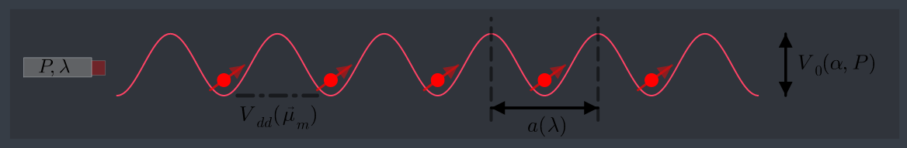{width=100%}
</center>
<br>
<center>
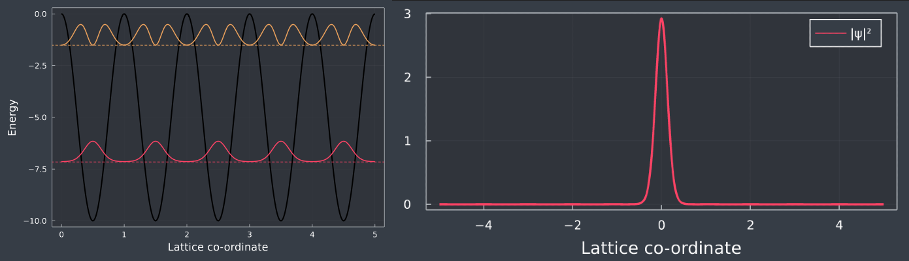{width=100%}
</center>


## Bose Hubbard Model

<br>
<br>

$$\begin{aligned}
\hat{H}=& \int d^{3} \mathbf{r} \cdot \psi^{\dagger}(\mathbf{r})\left[-\frac{\hbar^{2} \nabla^{2}}{2 m}+V_{\text {ext. }}(\mathbf{r})\right] \psi(\mathbf{r})
+\frac{1}{2} \int \psi^{\dagger}(\mathbf{r}) \psi^{\dagger}\left(\mathbf{r}^{\prime}\right) \underbrace{V\left(\mathbf{r}^{\prime}-\mathbf{r}\right)}_{V_c + V_d} \psi\left(\mathbf{r}^{\prime}\right) \psi(\mathbf{r}) \cdot d^{3} \mathbf{r} d^{3} \mathbf{r}^{\prime}
\end{aligned}$$

 $\hspace{9.5cm}$nearest-neighbour $\hspace{1cm}\Bigg\Downarrow \hspace{1cm}\psi(r) = \sum_i w_{R_i}(r) \cdot a_i$

$$\boxed{H_{BH} = -t\cdot \sum_{\langle i,j \rangle} a_i^{\dagger}a_j + \frac{U}{2} \sum_i n_i(n_i -1) + V \sum_{\langle i, j \rangle} n_i n_j}$$
<br>
$$\small t_{i, j} = \int dr \cdot w^*_{R_i}(r) \cdot \hat{H} \cdot w_{R_j}(r)$$

$$\small V_c(r) = \frac{4π\hbar^2 a_s}{m}\cdot\delta(r) = g\cdot\delta(r) U_i \hspace{1cm}\longrightarrow \hspace{1cm} U_i = g \int dr \cdot |w_{R_i}(r)|^4$$

$$\small V_d(r, r') = \frac{\mu_0 \mu_m^2}{4\pi} \cdot \frac{(1 - 3\cos^2\theta)}{(r - r')^3} \hspace{1cm}\longrightarrow \hspace{1cm} V_{i, j} = \int dr^3 dr'^3 \cdot|w_{R_i}(r')|^2 \cdot V_d(r - r') \cdot |w_{R_j}(r)|^2 $$

## Bose Hubbard Model
<br>

$$H = -t\sum_{\langle i, j \rangle} a_i^{\dagger}a_j + \frac{U}{2}\sum_i n_i(n_i - 1)$$
<br>
<center>
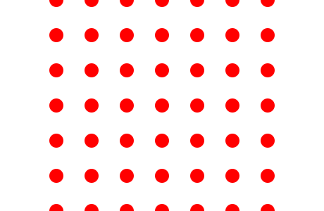{width=40%}
</center>

## Phases of the BHM

### Mott Insulator

$$\small H = \frac{U}{2}\sum_i n_i(n_i - 1) \hspace{0.5cm}\longrightarrow\hspace{0.5cm} |\Psi_{MI}\rangle = \prod_{i=1}^M |n\rangle$$
<center>
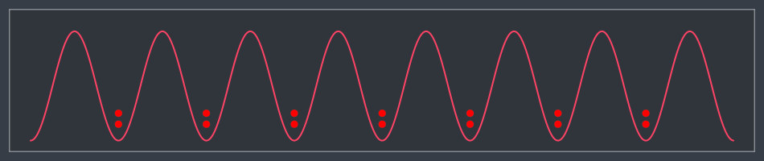{width=50%}
</center>

### Superfluid

$$\small H = -t\sum_{\langle i, j \rangle} a_i^{\dagger}a_j\hspace{0.5cm}\longrightarrow\hspace{0.5cm}|\Psi_{SF}\rangle= \frac{1}{N!} (\sum_{i=1}^M a_i^{\dagger})^N |{0}\rangle \hspace{0.5cm}$$

<center>
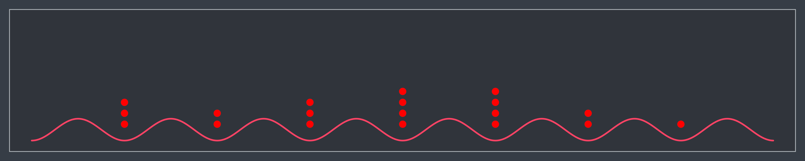{width=50%}
</center>

## Exact Diagonalization

Consider N bosons in M lattice sites.

<br>

- $$\text{Enumerate basis set: }\hspace{0.5cm} |n_1, n_2, ..., n_M\rangle \hspace{0.5cm} s.t. \hspace{0.5cm} \sum_{i=1}^M n_i = N$$
<br>
- $$\text{Construct hamiltonian matrix: }\hspace{0.5cm} \langle n_1, n_2, ..., n_M| \hspace{0.1cm}\hat{H} \hspace{0.1cm}| n_1', n_2', ..., n_M'\rangle$$
<br>
- $$\text{Diagonalize the hamiltonian: } \hspace{0.5cm} H|\psi\rangle = E|\psi\rangle$$


## Results (ED)
<center>
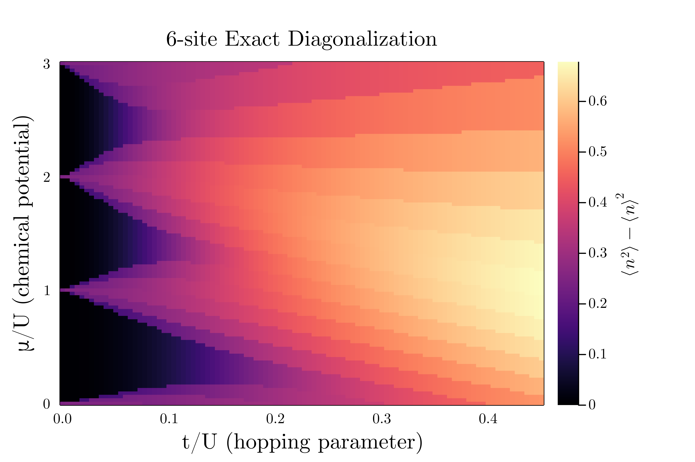{width=70%}
</center>


## Dimensionality scaling
$$\small\text{Dim }(\mathcal{H}) = \frac{(N+M-1)!}{N!(M-1)!}$$
<br>
<center>
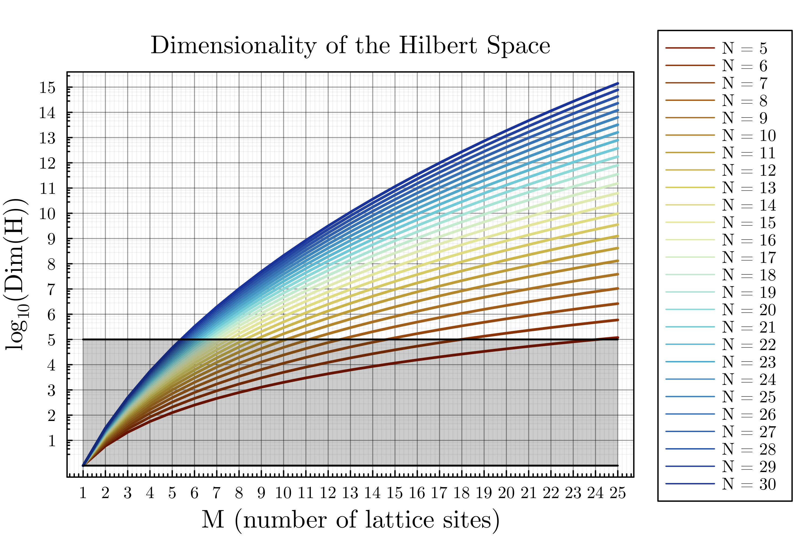{width=60%}
</center>

## Mean Field Theory
<br>
$$\small \hat{a}_i = \Psi + \delta\hat{a}_i \hspace{1cm} \Bigg |\hspace{1cm}\mathcal{O}(\delta \hat{a}_i ^2) \approx 0$$
<br>
<center>
{width=100%}

</center>
<br>
$$\small \underbrace{H = -t\sum_{\langle i, j \rangle} a_i^{\dagger}a_j + \frac{U}{2}\sum_i n_i(n_i - 1)}_{\text{coupled lattice sites}} \hspace{0.5cm}\longrightarrow\hspace{0.5cm} \underbrace{H \{\Psi \} = \sum_i-zt \cdot (\Psi^*a_i + \Psi a_i^{\dagger} - |\Psi|^2) + \frac{U}{2}n_i(n_i -1)}_{\text{de-coupled lattice sites}}$$

## Results (MFT)
<center>
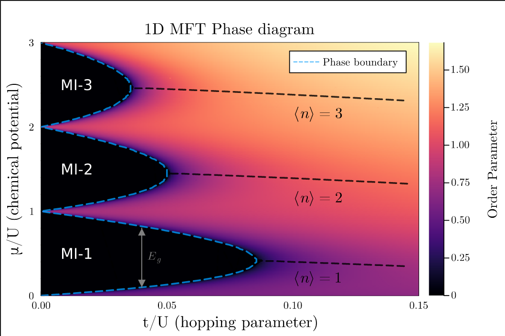{width=70%}
</center>

## Results (MFT, contd.)
<center>
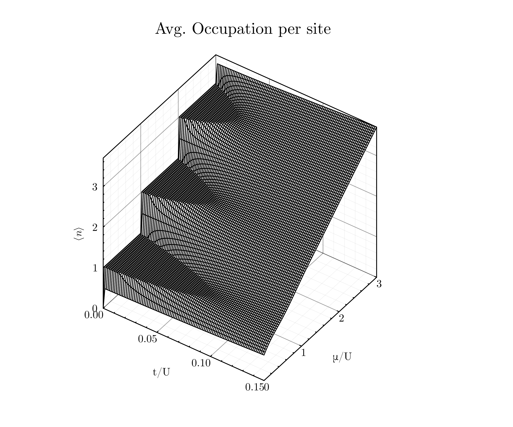{width=55%}
</center>

## Cluster Mean Field Theory

<br>
<br>

<center>
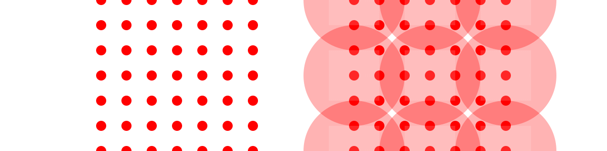{width=90%}
</center>

$$\small \underbrace{H = -t\sum_{\langle i, j \rangle} a_i^{\dagger}a_j + \frac{U}{2}\sum_i n_i(n_i - 1)}_{\text{coupled lattice sites}} \hspace{0.5cm}\longrightarrow\hspace{0.5cm} \underbrace{H \{\Psi_i \} = \sum_C H_{exact} + \sum_{C, C'}H_{MFT}\{ \Psi_i \}}_{\text{de-coupled clusters of sites}}$$

## Results (CMFT)
<center>
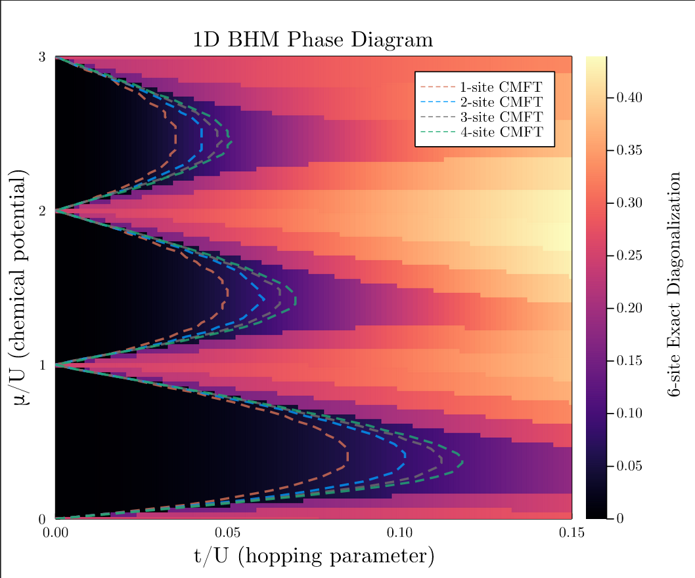{width=60%}
</center>

## Dipolar bosons in a lattice
<br>

$$H = -t\sum_{\langle i, j \rangle} a_i^{\dagger}a_j + \frac{U}{2}\sum_i n_i(n_i - 1) + V \sum_{\langle i, j \rangle} n_i n_j$$
<br>
<center>
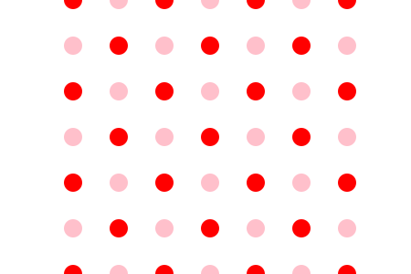{width=40%}
</center>

## Results (MFT)
<center>
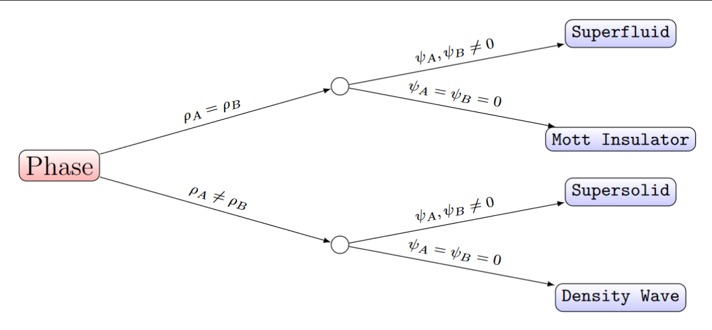{width=35%}
</center>
<br>
<center>
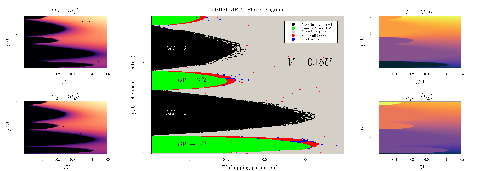{width=90%}
</center>

## Results (MFT, contd.)

<br>
<br>

<center>
{width=90%}
</center>

<br>

<center>
{width=50%}
</center>

## Path Integral QMC

Evaluate the partition function $Z = Tr(e^{\beta\hat{H}})$.

$$\begin{align}
Z &= \sum_{|n_1\rangle} \langle n_1 |\left (e^{\frac{\beta}{M}\hat{H}} \right )^M |n_1 \rangle \\
&= 
\lim_{M\to \infty} \ \ \sum_{|n_1\rangle} \langle n_1 |\left (1 + \frac{\beta}{M}\hat{H} \right)^M |n_1 \rangle \\
&\approx \sum_{\{|n_i\rangle\}} \langle n_1 |\left (1 + i\Delta t\hat{H} \right) |n_2 \rangle \cdot \langle n_2 |\left (1 + i\Delta t\hat{H} \right) |n_3 \rangle \dots \langle n_M |\left (1 + i\Delta t\hat{H} \right) |n_1 \rangle \\
&\approx \sum_{C_i \in C} w(C_i)
\end{align}$$

- Map d-dimensional quantum system to (d+1) classical system  ($\beta \rightarrow iM\Delta t$).

- Formulated as a classical system determined by a configuration - string of M basis elements; $C \equiv |n_1 \rangle \rightarrow |n_2 \rangle \rightarrow \dots \rightarrow |n_M \rangle\rightarrow |n_1 \rangle$. 

## Worldline representation

<center>
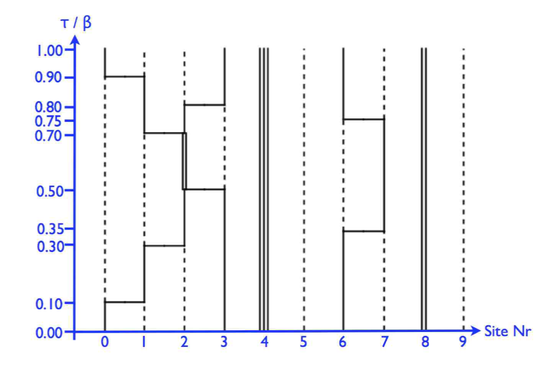{width=70%}
</center>

------
<br>
<center>
{width=70%}
</center>